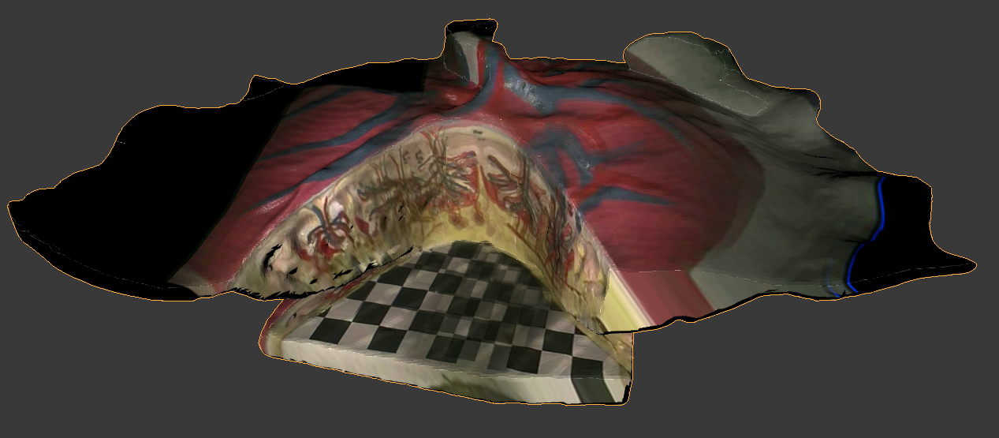

# Texture reconstruction data set tools

This repo contains the tools for texture reconstruction based on laparoscopic surgery data sets, made for Surgical 
Vision and Robotics group at UCL. This repository goes together with Timur Kuzhagaliyev's final year project, 
described in [this report](https://drive.google.com/open?id=1QT4nYPPCjCrJqFcet6b-yGSSvJUqmy7Y). If you're planning to
 use the code from this repository, you are strongly advised to look at sections 3 and 4 of the project report.


# Project structure

The purpose of each directory is described below:

* `ds_tools/`: This folder contains all of the Python source code for the project. Note that it's meant to act a 
self-contained Python package, meaning that code inside it uses package-absolute imports, e.g. 
`from ds_tools.shared import util`.
* `matlab_issi/`: Matlab code used to process data from the da Vinci surgical robot (acquired using a dvLogger). It's
 mostly based on the ISSI file processing functions provided by Intuitive Surgical Inc.
* `notebooks/`: This folder contains various Jupyter notebooks, mostly used for calibration purposes. The reason the 
calibration code is presented in the form of Jupyter notebooks is to make it easier to select the correct filters and
 debug the calibration process. Notes on how to use the notebooks can be found below.
* `data/`: The folder meant to hold data used for texture reconstruction. Since this usually includes large video and
 CSV files, the contents of this folder are ignored via `.gitignore`. 
* `resources/`: This folder contains various 3D assets and example output of projective texture mapping/texture 
reconstruction algorithms.

# Python packages

This project uses Python 3.5.2. You will need the following Python Pip packages to run the code in this project:
```
opencv-contrib-python==3.4.0.12
opencv-python==4.0.0.21
matplotlib==3.0.2
trimesh==2.36.16
panda3d==1.10.0
pandas==0.23.4
numpy==1.15.4
pycpd==1.0.5
scipy==1.2.0
```

These packages can be installed by running the following command at the root folder of this repository:
```bash
pip3 install -r requirements.txt
```

# Using custom data

As you might have noticed, this repository includes a `data/` folder. This folder is empty (except for a `.gitignore`
file) and is ignored by Git, which means that you can put anything in there and it won't affect your commits.

A lot of scripts and Jupyter notebooks in this repository assume that relevant files are located in the `data/` folder.
For example, the code that assumes that files `data/EndoscopeImageMemory_0.avi` and `data/pose_ecm.csv` exist will look
as follows:

```python
from os import path
from ds_tools.shared import util

data_dir = util.get_data_dir()
video_path = path.join(data_dir, 'EndoscopeImageMemory_0.avi')
pose_ecm_path = path.join(data_dir, 'pose_ecm.csv')
```

You are free to adjust the paths and filenames for your convenience. Note that you don't *have* to put your data into 
the `data/` folder - you can use your own absolute paths, e.g. `/home/my_user/my_data/pose_ecm.csv`. Keep in mind 
that the **output** some scripts generate might go into the `data/` folder by default.

**Important:** Example data for placenta phantom texture reconstruction can be downloaded [here](https://drive.google.com/open?id=1t78ZC9vEUOBj5gDyg9efxpATznlVgkvD). This archive has to be placed inside the `data/` folder and unzipped. The code in this repository has been 
adjusted to use this data set. You can use it as a reference when preparing your own data set for texture 
reconstruction.

# Using Jupyter notebooks

The `notebooks/` folder and its sub-directories contain Jupyter notebooks that showcase various tools from this 
repository. The Python import statements in these notebooks are relative to the `.ipynb` files, which means that the 
notebooks should work regardless of where you run `jupyter notebook`. That said, it's recommended to start the 
Jupyter server as follows:
```bash
cd notebooks/
jupyter notebook
```

# User manual

This section provides instructions on how to use each individual part of the project.

## Converting dvLogger output CSV files

dvLogger recorder is the tool used to record da Vinci kinematics and stereo endoscope footage. It starts logging data
 the moment it boots up, given it's connected to the da Vinci surgical system. The data for each recording session 
 contains multiple `.issi` files and 2 `.avi`. The two videos are the video footage from the left and right stereo 
 endoscope cameras respectively, and 3 of the `.issi` contain da Vinci kinematics and timestamps for video frames for
 each camera. Typical output of the dvLogger looks like this:
 ```
.
├── ...
├── DaVinciSiMemory.issi
├── EndoscopeImageMemory_0.avi
├── EndoscopeImageMemory_0.issi
├── EndoscopeImageMemory_1.avi
└── EndoscopeImageMemory_1.issi
```
  
To make these `.issi` files easier to use with Python, they must first be converted into the `.csv` format. This can 
be done using the `ConvertAll.m` script from the `matlab_issi/` folder. Place the `.issi` files listed above into 
`matlab_issi/`, then either run `ConvertAll.m` or run the following Matlab code directly:
```matlab
dvsm = ISSILoad('DaVinciSiMemory.issi');
eim0 = ISSILoad('EndoscopeImageMemory_0.issi');
eim1 = ISSILoad('EndoscopeImageMemory_1.issi');

dvsmData2csv(dvsm, 'DaVinciSiMemory.csv');
eimData2csv(eim0, 'EndoscopeImageMemory_0.csv');
eimData2csv(eim1, 'EndoscopeImageMemory_1.csv');
```

This code will convert all 3 files into CSV format, and save them into `matlab_issi/`, but it might be a good idea to
 move them to the `data/` folder. Note that this Matlab code can only be ran on a Windows edition of Matlab, since 
 some of the proprietary ISSI loading code from `matlab_issi/` folders uses encrypted binaries which are only 
 compatible with Windows.
 
## Syncing timestamps in dvLogger data
 
The timestamps in the CSV files generated above are not synced by default - some of the might skip several 
frames or have slightly different rates. The 3 CSV files and 2 AVI files need to be processed further to make sure 
the data is in sync. This can be done using the `sync_timestamps.py` script from the `ds_tools/scripts/` folder. Open
`sync_timestamps.py` and change the `capture_dir` variable to reflect the directory where your files are located.
 For example, if you were to place the files in `data/my_capture/`, you will have to update `capture_dir` to look as 
 follows:
```python
# ...
def main():
    data_dir = util.get_data_dir()
    capture_dir = path.join(data_dir, 'capture_dir')
    # ...
```

You can then run the script using:
```bash
python3 ds_tools/scripts/sync_timestamps.py
```

Once the script terminates, a folder called `synced/` will be created inside the directory you specified. This folder
 will contain the processed CSV files and AVI videos, all synced to 30 FPS.
 
## Segmenting 3D models from CT scans, UV unwrapping

CT scans almost always come as a collection of DICOM images, where each image represents a single slice through the 
volume of the scanned scene. `.DICOM` files can be viewed using [itk-SNAP](http://www.itksnap.org/pmwiki/pmwiki.php).
 Relevant objects, such as markers on the calibration object or markers on the endoscope collar, can be easily 
 segmented from the CT scan using one of [itk-SNAP's automatic segmentation tools](http://www.itksnap.org/docs/viewtutorial.php?chapter=TutorialSectionIntroductionToAutomatic) (snakes evolution tool is recommended). 

Note that groups of markers, e.g. all endoscope collar markers, must all be segmented into the same label, and each 
 distinct group should have its own label. The recorded surface, e.g. the walls of the recorded surgical phantom, can
 be segmented using the same approach.
  
Once segmentation is done, each label should be exported as a separate `.stl` mesh. This can be done using a built-in
 itk-SNAP tool for mesh export.

---

The object of the mesh whose texture will be reconstructed (e.g. surgical phantom) has to go through extra processing
 steps, such as smoothing and UV unwrapping. These steps can be carried out using [Blender](https://www.blender.org/)
 software. The relevant `.stl` can be imported into Blender using the built-in STL plugin (with orientation Z-up 
 Y-forward and same scaling as original model).
 
The number of faces can be reduced using Blender's [decimate modifier](https://docs.blender.org/manual/en/latest/modeling/modifiers/generate/decimate.html), and smoothing can be applied using [Laplacian 
smooth modifier](https://docs.blender.org/manual/en/latest/modeling/modifiers/generate/decimate.html). After smooth 
is complete, the mesh needs to be UV unwrapped. This can be done using angle based flattening (ABF) in Blender's smart
 UV projects (see [unwrapping guide](https://docs.blender.org/manual/en/latest/editors/uv_image/uv/editing/unwrapping/index.html)).
Some arbitrary texture must then be applied to the object (e.g. a chessboard pattern of size `2048 x 2048` pixels) to
 give texture reconstruction code some reference for the desired size of the figure.
 
Once the model is UV unwrapped and a texture is applied to it, it needs to be exported as an `.obj` file (since `.stl` 
doesn't encode UV mappings). This `.obj` file can then be used in texture reconstruction.


## Camera calibration

The code for camera calibration is expressed as Jupyter Notebooks found in `notebooks/calibration/`. The main goal of
 the calibration process is to produce `data/intrinsics.json` and `data/extrinsics.json` files which encode the 
 intrinsics and extrinsics parameters of the camera respectively. These can later be used to estimate the camera pose
 in various shot of the object whose texture is reconstructed.
 
All of the notebooks contain some default values which are built around the placenta phantom data set mentioned 
earlier, so it's a good idea to download it and use as reference.

**Intrinsics calibration**: Intrinsics are calibrated in the `intrinsics_calibration.ipynb` notebook. Calibration is 
done using footage of a planar chessboard pattern moving in front of the camera. Calibration can be done using a 
short video or by specifying a path to a folder that contains frames with calibration object visible (such frames can
 be extracted using video players, e.g. [VLC](https://www.videolan.org/vlc/index.en-GB.htm)). The output is 
 `data/intrinsics.json`, which records the intrinsic matrix, distortion coefficients and the image size of the camera.
 
If necessary, radial distortion coefficients can be refined by marking straight lines one some video frames 
using `ds_tools/scripts/mark_points.py` and then using `intrinsics_refining.ipynb`. Once intrinsics of the camera are
 known, `rectify_images.ipynb` can be used to correct distortion on arbitrary images taken by the camera.
 
**Extrinsics calibration**: Extrinsics calibration is done in two steps. First, we extract the shape of rigid body 
associated with the endoscope collar using `endoscope_rigidbody_calibration.ipynb`. To do that, we need the segmented
 endoscope markers from the calibration scene and the segmented endoscope markers from the actual data capture scene 
 (both extracted from different CT scans). Only the first set of markers is used to extract the shape of the rigid 
 body, the second set is just used to verify how accurate the segmentation is. This notebook creates the file 
 `data/extrinsics.json`.
 
The second step involves working out the extrinsics of the camera with respect to the rigid body defined in the 
previous step. This is done in `endoscope_camera_calibration.ipynb`. It requires meshes of endoscope markers (mesh 1)
and the mesh of markers of the calibration object (mesh 2), segmented from the CT scan of the calibration scene. It 
also requires an image from the endoscope cameras, taken at the time when CT scan was taken. All calibration markers
must be visible in the image. This process works out the transformation between the camera and the reference rigid 
body, and saves the result into `data/extrinsics.json`.

**3D render test**: To make sure that extrinsics and intrinsics are calibrated correctly, `3d_render_test.ipynb` is used
to generate a synthetic render of the scene with the phantom. It loads the JSON files generated in the previous 
steps, as well as the 3D mesh of the recorded object. The results for the placenta data set can be seen below.

This notebook also outputs the `data/phantom_scene.json` file, which contains information about the final camera 
parameters calculated explicitly for this scene. These parameters are automatically imported when you run 
the `ds_tools/calibration/render.py` script. The script lets you move the camera around to estimate camera poses for 
other frames from the endoscope video footage.

|  |  |
|-------------------------------------------|--------------------------------------|

## Projective texture mapping

To prepare the data for texture reconstruction, one should extract several frames that best cover the surface of 
interest from the endoscope footage, and estimate the camera pose using the method described above. Script 
`ds_tools/scripts/visualise_kinematics.py` provides a convenient way to preview videos from stereo cameras, allowing 
the user to take snapshots of the current frame from both cameras. Before it can be used, the file 
containing da Vinci kinematics, `DaVinciSiMemory.csv`, must be broken doing into individual CSV files (covering each 
manipulator), which can be done by running `ds_tools/scripts/split_join_csv.py`.
 
Once this data is available, images need to be renamed into the format `<index>_screenshot.png`, and camera 
parameters need to be stored in `capture_data.json` in the same order as the images. See 
`resources/placenta_images/` for reference. The alignment of images can be improved using 
`ds_tools/texture_mapping/camera_pose_refinement.py`, given that overlapping image projections have enough distinct 
edges.

**Converting data to UV space**: Once all of the images have correct names and `capture_data.json` is populated with 
camera poses, all of te data needs to be converted into UV space. This is done by running the 
`ds_tools/texture_mapping/texture_mapping_renderer.py` script. It initialises the 3D renderer, loads relevant meshes 
and images, and generates projections of every image using projective texture mapping. Example output of this script 
can be seen in the `resources/placenta_texture/` folder.

## Texture reconstruction

After all of the data is converted into UV space, the texture can be reconstructed by running the 
`ds_tools/texture_mapping/texture_merger.py` script. It generates confidence maps for every image projection, and 
then merges projection based on normalised confidence scores. Example output of this process can be seen on 
`resources/placenta_texture/base_final.png`.

For the example data, the texture was reconstructed using the mesh `resources/3d_assets/placenta.obj`. To view the 
final texture in 3D, this mesh can be imported into Blender, with its texture can be set to  
`resources/placenta_texture/base_final.png`, obtaining a result similar to:
